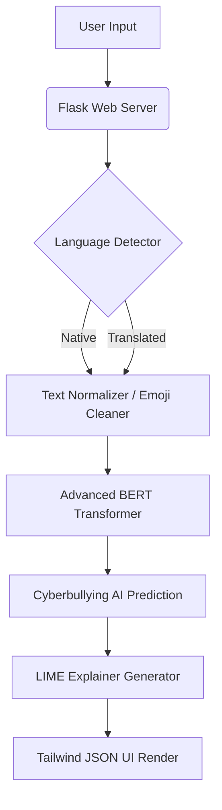

# CyberShield AI 🛡️

CyberShield AI is an advanced, multilingual cyberbullying and toxic text detection engine. It leverages state-of-the-art Natural Language Processing (NLP) techniques, particularly HuggingFace Transformers, to classify text across 10 different native languages. 

## Features ✨

* **Advanced NLP Pipeline**: Powered by `bert-base-multilingual-cased` for robust, context-aware sequence classification.
* **Massive Multilingual Support**: Detects and translates English, Hindi, Telugu, Tamil, Kannada, Malayalam, Bengali, Marathi, Urdu, and Spanish text dynamically.
* **Dynamic Explainability**: Integrated **LIME** (Local Interpretable Model-Agnostic Explanations) UI to highlight exactly *which* words triggered the AI's detection protocols.
* **Modern Web Interface**: Glassmorphism UI fully modernized with Tailwind CSS grids and micro-interactions.
* **Security & Performance**: Backend protected by `Flask-Limiter` to prevent DDoS against heavy AI endpoints. Model loading is cached for runtime efficiency.

## Architecture 🏗️



## Setup Instructions 🚀

### 1. Prerequisites
- **Python 3.10+** (Required for TF/Transformer optimizations)
- Optional: NVIDIA GPU + CUDA for significantly faster training and evaluation.

### 2. Local Installation
```bash
# Clone the repository
git clone https://github.com/Ediga-Meghana/CyberSheildAI.git
cd CyberSheildAI

# Install all dependencies
pip install -r requirements.txt
```

### 3. Running the Server

Start the local Flask server on port 5000:
```bash
python app.py
```
*Navigate to [http://localhost:5000](http://localhost:5000) to access the CyberShield UI.*

## Deployment ☁️
This application contains a `Dockerfile` and is completely containerization-ready.
```bash
docker build -t cybershield-ai .
docker run -p 5000:5000 cybershield-ai
```

## File Structure 📂
* `app.py`: Core application logic and model caching
* `models/advanced_model.py`: Modularized HF Transformer classification architecture
* `train_advanced.py`: Script executing structural dataset 70/15/15 splits and performing GridSearchCV hyperparameter evaluation
* `preprocessing/`: Scripts to resolve Unicode issues and clean emojis natively
* `routes/`: Expressive API endpoints for Predictions and Analytics
